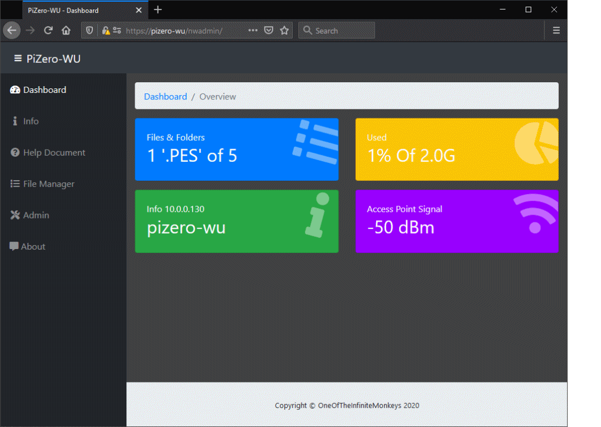

## Introduction

The PiZero-WU Raspberry Pi® Model Zero WiFi with USB memory stick emulation permits ready sharing and management of files. The on-board software allows a WiFi network folder to be accessed which appears to the USB connected device (e.g. television, sewing machine etc.) as a USB memory key / stick. 

Using the preferred customised file manager, Tiny File Manager. Files, including sewing files can be managed and viewed through a Web Browser.

This package is the web management interface for PiZero-WU WiFi Enabled USB key which manages the various software used in PiZero-WU and is derived from - Start Bootstrap - SB Admin(https://startbootstrap.com/template-overviews/sb-admin/).

Notes:  
  a) The USB memory key feature requires a Raspberry Pi with USB Gadget Mode (for example a PiZero)  
  b) This software is PHP and Python 3 (PHP generates web pages containing HTML, CSS and Javascript)  
  c) A Raspberry Pi is not madatory however, no other system is tested or supported  

## Preview
A preview of the nwadmin web interface for PiZero-WU is shown in the GIF animation below:

The animation runs through a number of the interactive forms on the PiZero-WU.
For Tiny File Manager see the project here: https://github.com/OneOfTheInfiniteMonkeys/tinyfilemanager

## Status
For master template:
[![GitHub license]
[![npm version]
[![Build Status]
[![dependencies Status]
[![devDependencies Status]

## Download and Installation

TBC

## Usage
TBC 

### Basic Usage

TBC

### Advanced Usage

TBC

## Bugs and Issues

TBC

## About

By OneOfTheInfininteMonkeys
https://github.com/OneOfTheInfiniteMonkeys/nwadmin

## Copyright and License

Copyright OneOfTheInfininteMonkeys (c) All Rights Reserved 2019, 2020

Code released under the TBC license.
